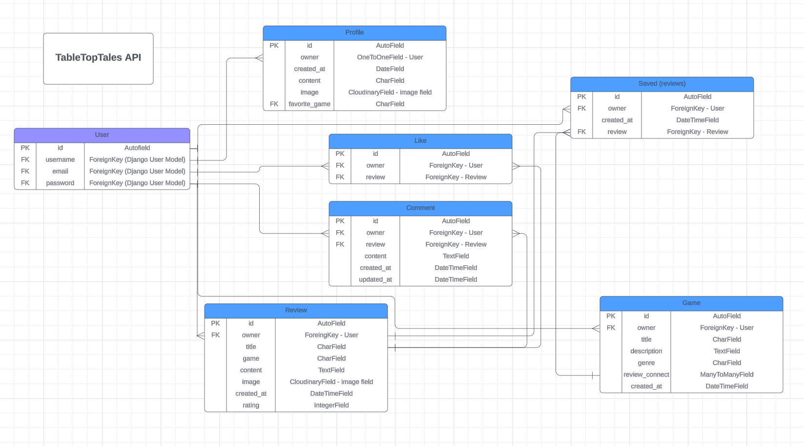

# **TableTopTales API**

TabletopTales is a social media site for board games enthusiasts, targeted towards people who love to play board games and want to share their reviews for others! As well as finding new games to add to their wishlist of games they want to play. 

On TableTopTales users can write their own review of a game, create games to add to their whishlist, connect those games to an existing review, like and comment on other reviews. 

The app is built in two parts with this making up the backend API and the front end is built with React.js. 

[Link to live site here](https://tabletoptales-718dd24dcac5.herokuapp.com/)

[Link to deployed backend API here](https://ttt-api-0a140d9077e3.herokuapp.com/)

## Project Goals
The goal of this site is to create a place where people can share reviews and discuss board games, and inspire other people to find their new favorite games! 

### User Goals

### Site owner Goals

## UX

### User Stories

The user of TableTopTales is anyone with an interest in board games and wants to share their experiences and thoughts on the board games they love, as well as anyone who wants to find a new board game to play. 

**Reviews**
- As a user I can create a review of a board game so that I can share my review with others
- As a User I can view all reviews created by other users so that I can be inspired and read about games that other people have reviewed
- As a user I can view a single review in detail so that I can get all details from that review
- As a user I can edit a review I have created so that I can make changes and updates to my own review after it has been created
- As a user I can delete my own review so that I can control the removal of my own reviews
- As a user I can save a review so that I can save them to read at a later point or return and read the saved reviews at any time
- As a user I can view the reviews I have saved so that I can return to reviews that I like, or so that I can read reviews that I didnt have time to finish earlier
- As a user I can remove previously saved reviews so that I can manage what reviews I want to keep as saved and remove those that are no longer of interest
- As a user I can like a review so that I can show that I appreciate the review and that it is interesting
- As a user I can remove i like I have previously made so that I can change my mind about if I like a review or not
- As a user I can comment on a review so that I can share my thoughts about the review and stay in contact with other users
- As a user I can view comments on a review so that I can see what I and other users are saying about a review
- As a user I can edit a comment that I have created so that I can make changes to a comment after I have made it, so that I can fix or update the content of a comment
- As a user I can view the top 5 most commented reviews so that I can see which reviews that engages the most
- As a user I can use the search bar to search for games or reviews so that I can find the games or reviews I am most interested in

**Authentication**
- As a user I can sign up and create a new account so that I can access features for signed up users, such as creating a review, comment and like a review, save a review and create a game to add to wishlist
- As a user I can sign in so that I can use features, creating a review, comment, like, saving a review and adding game to wishlist
- As a user I can stay logged in until I choose to log out so that I don't have to log in multiple times and so that my user experience is enhanced

**Navigation**
- As a user I can view and access the navbar on all pages so that so that I can easily navigate the site
- As a user I can view different parts of the navbar depending on my logged in/logged out status so that the correct options are available for users that are not logged in and users that are logged in, as well as the user knowing if they are logged in our not

**Profile**
- As a user I can view my own profile and other users profile and all reviews connected to that profile so that I can view a profile and see all reviews that they have written and other information they have shared in their profile
- As a user I can edit my own profile so that I can edit the content displayed there and change profile picture

**Wishlist**
- As a user I can create a game to add to my wish list of games so that I can keep track of games that I would like to play or buy in the future
- As a user I can edit a game added to my wish list of games so that I can update or correct information on my added game
- As a user I can delete a game I have created and added to wish list so that I can remove games that are no longer of interest
- As a user I can view the wish list of games I have created so that I can see what games I would like to play or buy in the future

### Design 
The design of the site is focused on being user friendly and giving the reviews center stage, as they are the main purpose and content of the site. Therefore the colors chosen are fairly neutral, especially the background color of a shade of grey. The two other colors in use are used consistently throughout the site in the same manner for buttons and other elements, to give the user a sense of familiarity when navigating the site. The font of Roboto was chosen as it is clean and easily read by the user. 

**Wireframes**

## Agile Development
The application was built using an agile approach, using a Github Project Board and Issues. The Github project board can be found [here](https://github.com/users/MorganStenberg/projects/7). All user stories listed above were created with Github Issues. All issues were linked to a milestone, 'Iterations', which was used to plan the development work of the project. The user stories were used to keep track of progress throughout the project, via different columns specifying the status of the issue. With columns for 'Todo', 'In progress', 'Done' and 'DoD'. DoD, or Definition of Done was used for user stories that had been implemented and gone through testing. I also added a column for 'Backlog' for future features to be implemented, as a way to keep control of the scope of the project and be sure to deliver a MVP in time.

## Data Models and database

The ERD diagram below lays out the structure for the data models. 

Django AllAuth was used for the user model and user authentication system.

The profile model was created so the user can create and save reviews and create a wishlist of games that can be edited and deleted. 

The game model contains all information on a game item that a user can create and add to a wishlist of games, such as creator of the game, title, description, review connection and a choice of genre. 

The reiew model contains all information about a review, such as creator, title, content, image, rating and created at information.  

The saved model enables the user to connect a wishlist game item to a review by saving the review. 

The like model contains all information about a like, such as which user has made it and which review it has liked. 

The comment model contains all information about a comment, such as which user has written it and on which review, the content of the comment and the creation date. 

## Features

### Existing features

#### Relevant on all pages

**Navbar**
- Contains logo and navigation links to all pages. Is constantantly located at the top as users would expect, and to be easily reached at all times. 
- Is displayed with active links, with the links displaying an orange color that stays when the user is on that page. Except for the profile page, to distingish that from other pages with content on. The links also display the orange color when the user hovers over them. 
- Displays different items depending on if the user is logged in or not, with sign up and sign in links displaying for users that are not logged in. And the other links to the different pages of the site displaying for logged in users.
- The navbar is responsive and collapses when the screen size decreases. All links are displayed when clicking the 'burger' icon.

**Loading spinner**
- A loading spinner is displayed on all pages where data is fetched from API, while data is being fetched. 

#### Home Page

- Intro, a short welcoming text that is displayed for users that are not logged in. Giving some context to what the purpose of the site is to new visitors. 

- Reviews, displayes a feed of reviews created by users. With the reviews being displayed with the latest displayed at the top. Infinite scrolling is active, meaning that the user can scroll infinitly as long as there is more content available

- The reviews are displayed as Cards with a structure of, title, image, rating, game, content (review text). At the bottom of the cards the avatar and username of the user that created the review is displayed to the left, with symbols for likes, comments and saving a post in the middle and lastly the date it was created to the bottom right. The title of the review also serves as a link to the detailed view of the review.

- Users can like and save all reviews, but their own. When the user has liked or saved a review, the symbol changes color to visually represent that the review has been liked or saved.
Next to the like symbol the number of likes is displayed. 

- Users can click on the comment symbol to be taken to the detailed view of the review where the comments are displayed and new ones can be created. Logged in users can comment on all posts. Next to the comment symbol the number of comments made to that review is displayed.

#### Detailed review

- Displays a review in the same structure as the home page, but in a wider format. And also displays the comments that have been made and a input field to make new comments on a review. 

- If the user is logged in and is the owner of the review they can click the three dots symbol in the bottom right corner to edit or delete the review. If the user clicks delete the review is removed and the user is taken back to the page they were previously on. 

- If the user is logged in and is a owner of a comment, then three dots are displayed to the right of the comment that the user can click to display a menu for editing and deleting a comment. 

- If the edit option of the menu is clicked then the comment is changed in to a input field where the user can choose to edit their comment, two buttons for save and cancel is displayed as well. They can also choose to cancel their edit by clicking the cancel button that is displayed.

- If the user chooses to delete their comment, the comment is removed and the user stays on the same page.

#### Most discussed (commented) reviews

- To the right of the feed of reviews there is a section for the most discussed reviews, which is displaying the top 5 reviews with the most comments on. The reviews are displayed as small cards with the Title of the review over the image of the review as background. When the cards are hovered over there is a orange outlining around the card. Each card also links to the review it is representing. 

- On smaller screens the section is moved to be displayed on top of the feed of reviews, in a smaller format with only the top 3 most discussed reviews. Otherwise it is displayed in the same structure with the image in the background and title on top. 

#### Saved reviews

- Displays the reviews the logged in user has chosen to save, in the same way and format as the home page, with infinite scrolling. As well as displaying the section for the most discussed reviews in the same way. 

#### Sign up/Log in

- The sign up page displays a form for the user to enter username and password to create a account/profile. Displays warning messages if the user has not entered the username and password correctly.

- Has a link to the sign in page as well. 

- The sign in page displays a form for the user to enter their username and password.

- Has a link to the sign up page if the user already has an account.

#### Create and edit review
- When clicking the create review button in the navbar the user is taken to the Create Review page, where a form with inputs for Title, Content, Game, Rating and an image section with a symbol for an image where the user can click and choose an image to upload if they want. 

- The form displays warnings if the fields are not empty or not valid. In the content field there is also included a rich text editor for the user to be able to customize their review text. The rating field contains a dropdown menu with choices ranging from 1-10. There are two buttons, Cancel takes the user back to their previous page and 'Share your tale' publishes the review.

- Editing a review

#### Profile
- The profile page displays information about a user, that has created an account on the site. The information displayed is username, profile image, favorite game, description (bio) and number of reviews written. The profile page also displays all the reviews written by that user as a feed as well. 

- When the user is visiting their own profile there are three dots in the top right corner where the user can access the menu for editing their username, password and profile in general. When clicking either of those the user is taken to a page with a form for updating or editing their profile information. If the user has not written any reviews yet, there is a text informing the visitor of the profile that. The profile page also has the section for most commented reviews. 

- When the user first creates an account they only choose a username and a password, the rest of the profile information can be added/updated via clickin the edit button on the three dots menu when visiting their own profile page. The fields are not required as the user should be able to decide on their own how much information they want to include in their own profile. 

#### Wishlist page and create and edit Game to add to wishlist
- The user can access the wishlist page by clicking the wishlist button in the navbar. If they have not created any games to add to their wishlist the page is empty and displays information to the user that they have not created any games yet, as well as presenting a button for the user to click to create games. 

- When clickin the add a game to your wishlist-button they are taken to the page for creating games. Which has similar form input fields as other parts of the site. They can add a game title/name, a short description and choose a genre from a prepopulated dropdown list of genres. 

- There is also a section to the right with a dropdown menu for connecting their wishlist game to a previously saved review. To enable the user to connect a wellwritten review for a game that they want to add to there wishlist of games. If they have no saved reviews there is a text displaying that information to the user. If they have saved reviews they are displayed with the titles of the review. This field is not required to add a new game, so the user can choose freely to add games without connecting them to reviews.

- Once the user has created a game to add to their wishlist, the games are displayed as cards with information on the title, description, genre and connected reviews, if there are any. There are also buttons for editing and deleting the wishlist games. 

- If the user clicks the edit button they are taken to the edit game page with the form fields prefilled, and they can update or edit any information they want. 

- If the user clicks the delete button the game is removed and the page is refreshed. 

#### Not Found
- Displays if the user enters an incorrect url, that does not exist on the page. Displays a small image and text saying the the page could not be found. 

### Future Features

- Adding tags to reviews to further categorize or sort the content. The user should be able to click on the tags to see all reviews with the same tags. 
- Making the reviews collapseable, so that not all the text is visible at once and the user should be able to choose to expand the review to view all the content. 
- Add a feature to have the most discussed reviews update every month/week, to keep the content changing. 

## Components

### Navbar
- The navbar component is displaying on all pages, with conditional rendering of navbar items depending on if the user is logged in or not. 

### Avatar
- Displays the users profile images, is used throughout the site everytime the users profile image is to be displayed. Such as next to reviews, in the navbar and comments section. 

### Asset
- Renders differently depending on what props are passed to it, is used throughout the site. Some uses are, rendering the loading spinner when content is being fetched and for displaying the not found image and text.  Can be used to display images and messages.

### MoreDropDown
- Is used to display a dropdown menu with options for editing or deleting. Is used for all reviews, profile and comments. 

### Not Found
- Is used to display a not found image and message. Is used to display information to the user when they enter a url that does not exist on the site. 

## Testing

See [TESTING](TESTING.md) for the full documentation of all testing done.

## Deployment

The site was deployed to Heroku from GitHub with the following steps:

- In the package.json file add this code `"heroku-prebuild": "npm install -g serve",` in the scripts section. Then create a Procfile in the root directory and add `web: serve -s build` in it.

- Create a Heroku app by logging in to your Heroku account. Click the "New" button in the top right corner and then "Create new app". Give it a name, choose a region and then click the "Create app" button. 

- In Gitpod or other IDE, save all files, add, commit and push your code to GitHub. Then go to Heroku, scroll to the top menu and click the "Deploy"-tab. Connect to your Github repository by selecting Github in the Deployment Method section and searching for your repository, either manually deploy the branch or activate "Enable Automatic Deploys". When the deployment is ready you can find the link to your deployed app. 

## Technologies, frameworks, libraries and languages used

### **Languages**

- HTML
- CSS 
- JSX

### **Libraries**
- [React](https://legacy.reactjs.org/) - main Javascript library for creating the user interface.
- [react-Bootstrap](https://react-bootstrap-v4.netlify.app/) - to make the site responsive and to style user interface.
- [axios](https://axios-http.com/docs/intro) - HTTP library used to make requests.
- [react-router-dom](https://reactrouter.com/en/main) - routing based on URL.
- [jwt-decode](https://www.npmjs.com/package/jwt-decode) - decoding of JWTs token.
- [react-dom](https://www.npmjs.com/package/react-dom) - the entry point to the DOM and server renderers for React.
- [react-infinite-scroll-component](https://www.npmjs.com/package/react-infinite-scroll-component) - component to implement infinite scrolling.
- [react-scripts](https://www.npmjs.com/package/react-scripts) - scripts and configuration used by Create React App.

### **Software and Sites**
- [Git and GitHub](https://github.com/)- Version control and used as tool for agile development with Github Projects
- [Cloudinary](https://cloudinary.com/) - Image hosting and management
- [ElephantSQL](https://www.elephantsql.com/) - Free database service that hosts the PostgreSQL database for this project 
- [Lucidchart](https://www.lucidchart.com/pages/sv) - Used for creating ERD diagram
- [Balsamiq](https://balsamiq.com/) - Used to create wireframes 

## Credits

## Acknowledgements